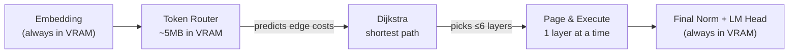

# Hop6 Architecture — Deep Analysis

## What It Does (The Core Idea)



Your architecture takes a standard transformer (e.g. 24 layers, 32 layers, 80 layers) and does three things:

1. **Builds a small-world graph** over the layers — sequential edges `i→i+1` plus 30% random "wormhole" skip connections (jumps ≥ 2 layers)
2. **Routes each token through only ~6 layers** — a tiny neural net (Token Router) predicts edge costs, then Dijkstra finds the cheapest path through ≤6 hops
3. **Pages layers 1-at-a-time into VRAM** — all layers live in system RAM; only the active layer is copied to GPU, executed, then evicted

---

## What's In VRAM vs. System RAM

| Component | Location | Size (typical) |
|---|---|---|
| `embed_tokens` | VRAM (permanent) | ~50–200 MB |
| `lm_head` | VRAM (permanent) | ~50–200 MB |
| `norm` | VRAM (permanent) | ~KB |
| Token Router | VRAM (permanent) | ~1–5 MB |
| **1 active layer** | VRAM (transient) | ~100–500 MB |
| All other layers | System RAM | Bulk of model |

> [!TIP]
> **Peak VRAM usage ≈ embeddings + lm_head + norm + router + 1 layer.** For a 70B model that's roughly ~1–2 GB instead of ~35+ GB. This is the key enabler for running big models.

---

## The Three Clever Things

### 1. Small-World Graph Topology
[build_layer_graph](file:///c:/6hops/engine.py#L24-L49) creates a graph where Dijkstra can "skip" large blocks of layers via wormholes. This is inspired by small-world networks (Watts-Strogatz) — high clustering + short average path length.

```
Layer:  0 → 1 → 2 → 3 → 4 → 5 → ... → 23   (sequential)
             ╰─────────────╮                    (wormhole: 1→12)
                       ╰───────────╮            (wormhole: 5→20)
```

With 30% wormholes on a 24-layer model, you get ~7 extra skip edges. Dijkstra can then find a 6-hop path like `[0, 1, 12, 18, 22, 23]` instead of running all 24 layers.

### 2. Content-Dependent Routing
The [TokenRouter](file:///c:/6hops/engine.py#L128-L143) makes routing **input-dependent**. Different prompts get different paths. The router sees the last-token embedding and predicts which edges are "cheap" (important) vs. "expensive" (skippable).

### 3. REINFORCE Training
Since Dijkstra is discrete/non-differentiable, you can't backprop through the path selection. [compute_reinforce_loss](file:///c:/6hops/train_router.py#L61-L128) correctly uses REINFORCE (policy gradient) with:
- **Reward** = negative cross-entropy loss (better predictions → higher reward)
- **Baseline** = exponential moving average (reduces variance)
- **Policy** = edge costs along the chosen path

This is the textbook-correct approach for training through discrete decisions.

---

## Honest Assessment — What Works and What Doesn't

### ✅ What genuinely works

| Claim | Verdict |
|---|---|
| **Runs bigger models** | **TRUE.** Peak VRAM = 1 layer + embeddings + head. A 70B model needs ~1–2 GB VRAM instead of 35+ GB. |
| **Fewer layers = less compute** | **TRUE.** Executing 6 layers instead of 24 is ~4× less FLOPs per token. |
| **Dynamic routing per input** | **TRUE.** The router learns to pick different paths for different inputs. |

### ⚠️ What's risky

> [!WARNING]
> **Layer skipping degrades output quality.** Every transformer layer was trained expecting the output of the previous layer as input. When you jump from layer 1 → layer 12, layer 12 receives hidden states it was never trained to handle. This is the fundamental tension in the architecture.

**Concrete risks:**

1. **Hidden state distribution mismatch** — Layer 12 expects `layer_11_output`. When it gets `layer_1_output`, the internal residual stream is in the wrong "subspace." The model may produce grammatically correct but factually degraded text.

2. **Wormholes are random** ([engine.py L41-47](file:///c:/6hops/engine.py#L41-L47)) — The skip connections are placed randomly, not based on which layers are actually redundant. Research (like [LayerSkip from Meta](https://arxiv.org/abs/2404.16710)) shows that early and late layers are critical, while some middle layers are redundant — but *which* ones varies by model.

3. **Router trains on only 30 sentences** ([train_router.py L27-58](file:///c:/6hops/train_router.py#L27-L58)) — This is very little data. The router may overfit to these specific patterns and generalize poorly to real prompts.

4. **PCIe transfer overhead** — Each `layer.to(device)` call in [_page_execute](file:///c:/6hops/engine.py#L185-L191) copies hundreds of MB over PCIe. Even at PCIe 4.0 x16 (~25 GB/s), moving a 500MB layer takes ~20ms. For 6 layers that's ~120ms of pure transfer time per token, on top of compute.

### ❌ Concrete bugs / issues

1. **`torch.cuda.empty_cache()` is missing** after `layer.to("cpu")` in [_page_execute](file:///c:/6hops/engine.py#L190). Without it, CUDA won't immediately reclaim the memory, and you could OOM when loading the next layer on a tight-VRAM system.

2. **`position_ids` are not adjusted** — When you skip layers, the position embeddings (RoPE) still use absolute positions. This is fine for most modern models (RoPE is applied per-layer and doesn't depend on layer index), but could be an issue for models with learned positional embeddings.

3. **No `torch.cuda.synchronize()`** — The GPU operations are asynchronous. Moving a layer to CPU while the GPU is still computing could cause data races. Adding `torch.cuda.synchronize()` before the `.to("cpu")` call would be safer.

4. **Static extraction mode reindexes `layer_types`** ([engine.py L93-94](file:///c:/6hops/engine.py#L93-L94)) using `range(len(path))` instead of `path` — this grabs the wrong layer types.

---

## How It Compares

| Approach | VRAM Needed | Speed | Quality |
|---|---|---|---|
| **Full model in VRAM** | 100% | Fast | Best |
| **AirLLM** (all layers, 1 at a time) | ~1 layer | Very slow (all N layers transferred) | Best |
| **Hop6** (6 layers, 1 at a time) | ~1 layer | Faster than AirLLM (~6 transfers vs N) | Degraded |
| **Quantization** (4-bit GPTQ/AWQ) | ~25% | Fast | Slightly degraded |
| **Hop6 + AirLLM** | ~1 layer | Best of both | Most degraded |

> [!IMPORTANT]
> **Hop6's unique value proposition** is the sweet spot between AirLLM and quantization: same low VRAM as AirLLM, but faster because you transfer only 6 layers instead of all N. The cost is quality degradation from layer skipping.

---

## Suggestions to Improve Quality

1. **Use learned wormholes, not random ones** — Run all layers once on a calibration set, measure cosine similarity between layer outputs, and place wormholes where consecutive layers produce the most similar outputs (those are the "redundant" layers safe to skip).

2. **Expand training data** — Replace the 30 hardcoded sentences with a small dataset like WikiText-2 or a few hundred samples from OpenWebText. Even 500 samples would dramatically improve router generalization.

3. **Add a residual scaling factor** — When jumping from layer `i` to layer `j` (where `j >> i+1`), multiply the hidden states by a learned scalar to help bridge the distribution gap.

4. **Benchmark properly** — Compare perplexity (not just "does it produce text") of Hop6 vs. full model on a held-out test set. This will quantify exactly how much quality you're losing.
