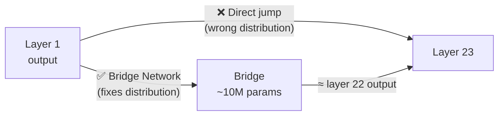

# Bridge Network — Fix Quality Degradation in Hop6

## The Problem You Identified

When Hop6 jumps from layer 1 → layer 23, layer 23 receives hidden states from layer 1 — but it was trained expecting output from layer 22. This **distribution mismatch** is the #1 cause of quality loss.

Your idea: use a small AI to predict "what layer 22 would have outputted" given layer 1's output, then feed that to layer 23.



## User Review Required

> [!IMPORTANT]
> **Don't use a full 500M parameter model.** Here's why:
> - A 500M model at fp16 = **1 GB VRAM** — this eats your VRAM budget (you'd need to page it too, killing speed)
> - A 500M model has its own inference latency (~20-50ms per forward pass)
> - The bridge only needs to transform a hidden state vector (size 2048-8192) to another vector of the same size — a much simpler task than full language generation
> 
> **Recommended: ~5-20M parameter shared bridge that stays permanently in VRAM (~10-40 MB).** This is comparable to your existing Token Router.

## Open Questions

> [!IMPORTANT]
> **Bridge architecture choice:** Should the bridge be:
> - **(A) MLP-based** — 3 linear layers with ReLU, ~5M params, fastest inference (~0.1ms)
> - **(B) Single Transformer Block** — 1 self-attention + FFN, ~15-20M params, captures sequence-level patterns better (~1ms)
> 
> I recommend **(A) MLP** to start — it's simpler, faster, and the transformation is primarily per-token, not sequence-level.

> [!IMPORTANT]
> **Training data:** To train the bridge, we need hidden states captured from the full model. This requires one full forward pass through ALL layers on a calibration dataset (~500 samples). This is a one-time cost. Is that acceptable?

## How It Works

### Step 1: Calibration (One-Time)

Run the full model on ~500 text samples. At every layer, capture the hidden states:

```python
# Pseudocode
calibration_data = {}
h = embed(tokens)
for i in range(num_layers):
    h = layer[i](h)
    calibration_data[i] = h.clone()  # save layer i's output
```

### Step 2: Train the Bridge

For every possible wormhole jump `(src, dst)`, the bridge learns:

```
bridge(h_src, src_idx, dst_idx) ≈ calibration_data[dst - 1]
```

The bridge receives:
- `h_src` — the hidden states from the source layer
- `src_idx`, `dst_idx` — which layers we're jumping from/to (as learned embeddings)

It outputs adjusted hidden states that approximate what `layer[dst-1]` would have produced.

**Loss function:** MSE between bridge output and actual `layer[dst-1]` output from calibration.

### Step 3: Use During Inference

```
Original:  Layer 1 ──────────────────────→ Layer 23
                    (distribution mismatch)

With Bridge: Layer 1 → Bridge(h, 1, 23) → Layer 23
                       (≈ layer 22 output)
```

The bridge runs **only on wormhole jumps** (gaps > 1). Sequential edges (layer `i` → layer `i+1`) don't need bridging.

---

## Proposed Changes

### Core Engine

#### [MODIFY] [engine.py](file:///media/abhay/OS/6hops/engine.py)

**New class: `BridgeNetwork`** (~5M params)

```python
class BridgeNetwork(nn.Module):
    """Transforms hidden states across layer gaps to fix distribution mismatch."""
    def __init__(self, hidden_dim, num_layers, bottleneck_ratio=4):
        super().__init__()
        self.layer_embed = nn.Embedding(num_layers, hidden_dim // 8)
        embed_input = hidden_dim + 2 * (hidden_dim // 8)  # h + src_embed + dst_embed
        mid = hidden_dim // bottleneck_ratio
        self.net = nn.Sequential(
            nn.Linear(embed_input, mid),
            nn.GELU(),
            nn.Linear(mid, mid),
            nn.GELU(),
            nn.Linear(mid, hidden_dim),
        )
        self.gate = nn.Parameter(torch.zeros(1))  # learnable residual gate

    def forward(self, h, src_idx, dst_idx):
        src_e = self.layer_embed(torch.tensor(src_idx, device=h.device))
        dst_e = self.layer_embed(torch.tensor(dst_idx, device=h.device))
        # Broadcast embeddings across sequence length
        src_e = src_e.unsqueeze(0).unsqueeze(0).expand_as(h[..., :src_e.shape[-1]])
        dst_e = dst_e.unsqueeze(0).unsqueeze(0).expand_as(h[..., :dst_e.shape[-1]])
        x = torch.cat([h, src_e, dst_e], dim=-1)
        delta = self.net(x)
        return h + torch.sigmoid(self.gate) * delta  # gated residual
```

Key design choices:
- **Gated residual** (`h + gate * delta`): The gate starts at 0, so the bridge starts as identity (no change). It gradually learns to apply corrections. This means the bridge can never make things *worse* than the current system.
- **Layer embeddings**: The bridge knows *which* layers it's jumping between, so it can learn different corrections for different jumps.
- **Bottleneck**: Compresses to `hidden_dim/4` to keep param count low.

**Modify `_page_execute`** to apply bridge on wormhole jumps:

```python
def _page_execute(self, layer_idx, hidden_states, prev_layer_idx=None, ...):
    # Apply bridge if this is a wormhole jump (gap > 1)
    if prev_layer_idx is not None and (layer_idx - prev_layer_idx) > 1:
        hidden_states = self.bridge(hidden_states, prev_layer_idx, layer_idx)
    
    layer = self.layers[layer_idx]
    layer.to(self.target_device)
    out = layer(hidden_states, ...)
    layer.to("cpu")
    return out[0]
```

**Modify `forward`** to track previous layer index:

```python
prev_idx = None
for layer_idx in path:
    hidden_states = self._page_execute(layer_idx, hidden_states, prev_layer_idx=prev_idx, ...)
    prev_idx = layer_idx
```

---

### Bridge Training

#### [NEW] [train_bridge.py](file:///media/abhay/OS/6hops/train_bridge.py)

Two-phase training script:

1. **Phase 1 — Calibration**: Run full model forward pass on ~500 samples, save hidden states at each layer to disk
2. **Phase 2 — Train Bridge**: For each (src, dst) pair in the graph edges, train the bridge to minimize `MSE(bridge(h_src, src, dst), h_{dst-1})`

Training loop (~5-10 minutes on GPU, ~30 min on CPU):
```python
for epoch in range(epochs):
    for text in calibration_data:
        # Get cached layer outputs from Phase 1
        for (src, dst) in wormhole_edges:
            h_src = cached_outputs[src]
            h_target = cached_outputs[dst - 1]  # what dst expects
            h_pred = bridge(h_src, src, dst)
            loss = F.mse_loss(h_pred, h_target)
            loss.backward()
            optimizer.step()
```

---

### CLI Integration

#### [MODIFY] [cli.py](file:///media/abhay/OS/6hops/cli.py)

- Add bridge training as **Step 3** in `action_download()` (after router training)
- Auto-load bridge weights in `action_dijkstra()` alongside router weights
- Save bridge weights to `routers/<model_name>/bridge.pt`

---

## VRAM Budget After Changes

| Component | Before | After |
|---|---|---|
| embed_tokens | ~100 MB | ~100 MB |
| lm_head | ~100 MB | ~100 MB |
| norm | ~KB | ~KB |
| Token Router | ~1-5 MB | ~1-5 MB |
| **Bridge Network** | **—** | **~10-40 MB** |
| 1 active layer | ~200-500 MB | ~200-500 MB |
| **Total peak** | **~400 MB–700 MB** | **~410 MB–740 MB** |

> [!TIP]
> The bridge adds only **~10-40 MB** to VRAM — negligible compared to the layer paging. You keep the same low-VRAM advantage.

---

## Verification Plan

### Automated Tests
```bash
# Test 1: Bridge produces correct output shape
python -c "from engine import BridgeNetwork; import torch; b = BridgeNetwork(2048, 24); print(b(torch.randn(1,10,2048), 1, 23).shape)"

# Test 2: Full pipeline with bridge
python -c "
from engine import Hop6DijkstraEngine
from transformers import AutoModelForCausalLM
model = AutoModelForCausalLM.from_pretrained('Qwen/Qwen2.5-0.5B', torch_dtype='auto', device_map='cpu')
engine = Hop6DijkstraEngine(model, target_device='cpu')
print('Bridge params:', sum(p.numel() for p in engine.bridge.parameters()))
"
```

### Quality Measurement
- Measure perplexity on 100 held-out sentences: **without bridge** vs. **with bridge**
- Expected: bridge should lower perplexity (= better predictions) by 10-30%

### Manual Verification
- Run the same prompt through full model, Hop6 without bridge, and Hop6 with bridge
- Compare output coherence side-by-side
